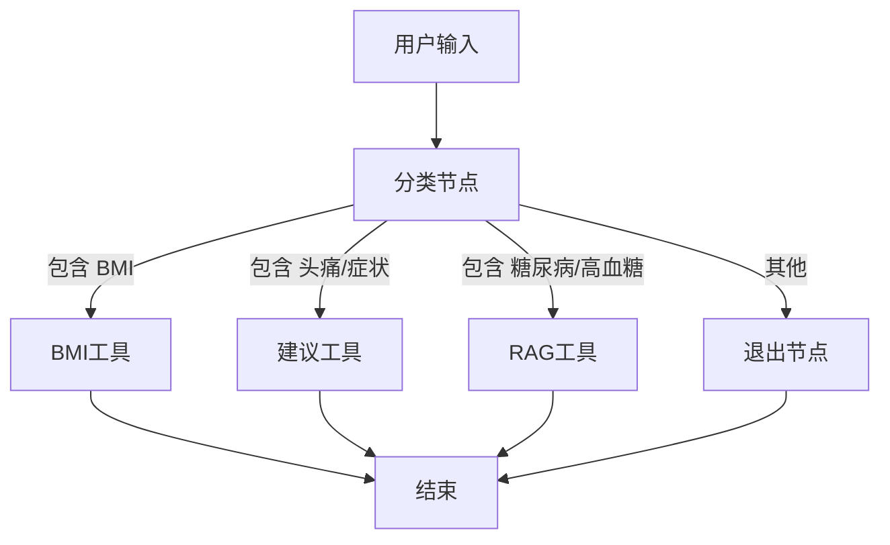

# Medical LangChain Agent

这是一个医疗问答智能助手，基于 LangChain Agent 构建，支持以下功能：

- 📄 医学知识问答（RAG）
- 🧮 BMI 指数计算
- 📋 根据症状提供初步就诊建议

## 快速开始

```bash
git clone ...
cd medical-agent
pip install -r requirements.txt
```

设置 `.env` 文件：

```
OPENAI_API_KEY=你的KEY
```

运行：

```bash
python main.py
```

## 示例问法

- 我的身高是1.75米，体重是70公斤，BMI是多少？
- 我最近总是头痛，怎么办？
- 糖尿病患者需要监测哪些指标？


---

## 🚀 LangGraph 医疗智能 Agent 工作流图



---


